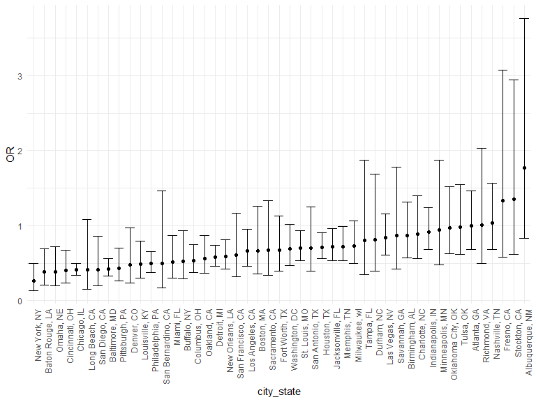

hw6
================
Yiyao LI
2020-12-10

### Problem 1

``` r
homicide_df = 
  read_csv("data/homicide-data.csv", na = c("", "NA", "Unknown")) %>% 
  mutate(
    city_state = str_c(city, state, sep = ", "),
    victim_age = as.numeric(victim_age),
    resolution = case_when(
      disposition == "Closed without arrest" ~ 0,
      disposition == "Open/No arrest"        ~ 0,
      disposition == "Closed by arrest"      ~ 1)
  ) %>% 
  filter(
    victim_race %in% c("White", "Black"),
    city_state != "Tulsa, AL") %>% 
  select(city_state, resolution, victim_age, victim_race, victim_sex)
```

    ## Parsed with column specification:
    ## cols(
    ##   uid = col_character(),
    ##   reported_date = col_double(),
    ##   victim_last = col_character(),
    ##   victim_first = col_character(),
    ##   victim_race = col_character(),
    ##   victim_age = col_double(),
    ##   victim_sex = col_character(),
    ##   city = col_character(),
    ##   state = col_character(),
    ##   lat = col_double(),
    ##   lon = col_double(),
    ##   disposition = col_character()
    ## )

Start with one city.

``` r
baltimore_df =
  homicide_df %>% 
  filter(city_state == "Baltimore, MD")
glm(resolution ~ victim_age + victim_race + victim_sex, 
    data = baltimore_df,
    family = binomial()) %>% 
  broom::tidy() %>% 
  mutate(
    OR = exp(estimate),
    CI_lower = exp(estimate - 1.96 * std.error),
    CI_upper = exp(estimate + 1.96 * std.error)
  ) %>% 
  select(term, OR, starts_with("CI")) %>% 
  knitr::kable(digits = 3)
```

| term              |    OR | CI\_lower | CI\_upper |
| :---------------- | ----: | --------: | --------: |
| (Intercept)       | 1.363 |     0.975 |     1.907 |
| victim\_age       | 0.993 |     0.987 |     1.000 |
| victim\_raceWhite | 2.320 |     1.648 |     3.268 |
| victim\_sexMale   | 0.426 |     0.325 |     0.558 |

Try this across cities.

``` r
models_results_df = 
  homicide_df %>% 
  nest(data = -city_state) %>% 
  mutate(
    models = 
      map(.x = data, ~glm(resolution ~ victim_age + victim_race + victim_sex, data = .x, family = binomial())),
    results = map(models, broom::tidy)
  ) %>% 
  select(city_state, results) %>% 
  unnest(results) %>% 
  mutate(
    OR = exp(estimate),
    CI_lower = exp(estimate - 1.96 * std.error),
    CI_upper = exp(estimate + 1.96 * std.error)
  ) %>% 
  select(city_state, term, OR, starts_with("CI")) 
```

``` r
models_results_df %>% 
  filter(term == "victim_sexMale") %>% 
  mutate(city_state = fct_reorder(city_state, OR)) %>% 
  ggplot(aes(x = city_state, y = OR)) + 
  geom_point() + 
  geom_errorbar(aes(ymin = CI_lower, ymax = CI_upper)) + 
  theme(axis.text.x = element_text(angle = 90, hjust = 1))
```



## Problem 2

read in the data

``` r
baby_df = 
  read_csv("./data/birthweight.csv")
```

    ## Parsed with column specification:
    ## cols(
    ##   .default = col_double()
    ## )

    ## See spec(...) for full column specifications.

clean the data for regression analysis factors: babysex, malform, frace,
mrace

``` r
baby_df=
baby_df %>%
   mutate(
     babysex = case_when(
       babysex == 1 ~ "male", 
       babysex == 2 ~ "female"),
     malform = case_when(
       malform == 0 ~ "absent",
       malform == 1 ~ "present"),
     frace = recode(frace, `1` = "White", `2`="Black", `3` = "Asian", `4` = "Puerto Rican", `8` = "Other", `9` = "Unknown"),
     mrace = recode(mrace, `1` = "White", `2`="Black", `3` = "Asian", `4` = "Puerto Rican", `8` = "Other", `9` = "Unknown"))
```

regression model:

first step: select variables

``` r
select_df
```

    ## # A tibble: 14 x 5
    ##    term               estimate std.error statistic   p.value
    ##    <chr>                 <dbl>     <dbl>     <dbl>     <dbl>
    ##  1 (Intercept)       -6145.      142.      -43.3   0.       
    ##  2 babysexmale         -28.6       8.45     -3.38  7.37e-  4
    ##  3 bhead               131.        3.45     37.9   3.10e-272
    ##  4 blength              74.9       2.02     37.1   4.29e-262
    ##  5 delwt                 4.11      0.392    10.5   2.26e- 25
    ##  6 fincome               0.318     0.175     1.82  6.88e-  2
    ##  7 gaweeks              11.6       1.46      7.93  2.79e- 15
    ##  8 mheight               6.59      1.78      3.69  2.23e-  4
    ##  9 mraceBlack          -63.9      42.4      -1.51  1.32e-  1
    ## 10 mracePuerto Rican   -25.8      45.4      -0.569 5.70e-  1
    ## 11 mraceWhite           74.9      42.3       1.77  7.68e-  2
    ## 12 parity               96.3      40.3       2.39  1.70e-  2
    ## 13 ppwt                 -2.68      0.427    -6.26  4.20e- 10
    ## 14 smoken               -4.84      0.586    -8.27  1.75e- 16

``` r
select_data = lm(
  bwt ~ bhead + blength + delwt + fincome + gaweeks + mheight + parity + ppwt + smoken + babysex + mrace, data = baby_df)
```

I found there are interesting positive relationship between delwt and
bwt. Also, momheight is positively related to bwt. Here is the
regression process to explore the relationships.

``` r
baby_df %>%
  ggplot(aes(x=delwt,y=bwt,color=mheight))+
  geom_point(size=1.2, alpha=0.5) 
```


From the plot, we can infer that delwt is positively related to mheight.
And delwt and mheight are both positively related to bwt.

``` r
linear_df = lm(bwt ~ delwt + mheight, data = baby_df)
broom::tidy(linear_df)
```

    ## # A tibble: 3 x 5
    ##   term        estimate std.error statistic  p.value
    ##   <chr>          <dbl>     <dbl>     <dbl>    <dbl>
    ## 1 (Intercept)  1184.     179.         6.60 4.76e-11
    ## 2 delwt           5.80     0.367     15.8  7.86e-55
    ## 3 mheight        17.1      3.06       5.59 2.46e- 8

The linear\_df attested my assumption.

``` r
delwt_r=
modelr::add_residuals(baby_df, linear_df) %>%
  ggplot(aes(x=delwt,y=resid,color = delwt))+
   geom_point() 

mheight_r=
modelr::add_residuals(baby_df, linear_df) %>%
  ggplot(aes(x=mheight,y=resid,color = mheight))+
   geom_point() 

residuals = delwt_r + mheight_r
residuals
```


``` r
delwt_p=
modelr::add_predictions(baby_df, linear_df) %>%
  ggplot(aes(x=delwt,y=pred,color= delwt))+
   geom_point() 

mheight_p=
modelr::add_predictions(baby_df, linear_df) %>%
  ggplot(aes(x=mheight,y=pred,color = mheight))+
   geom_point() 

predictions = delwt_p + mheight_p
predictions
```


### comparison

``` r
model_blength_gaweeks = lm(bwt ~ blength + gaweeks, data = baby_df)

model_mixture = lm(bwt ~ bhead + blength + babysex + bhead*blength + bhead*babysex + blength*babysex + bhead*blength*babysex, data = baby_df)
```

#### Compare

``` r
cv_df =
  crossv_mc(baby_df,100) %>%
  mutate(
    train = map(train, as_tibble),
    test = map(test, as_tibble)) %>% 
  mutate(
    model  = map(.x = train, ~lm(bwt ~ delwt + mheight, data = .x)),
    model_blength_gaweeks = map(.x = train, ~ lm(bwt ~ blength + gaweeks, data = .x)),
    model_mixture = map(.x = train, ~lm(bwt ~ bhead * blength * babysex, data = .x))) %>% 
  mutate(
    rmse_model = map2_dbl(model, test, ~rmse(model = .x, data = .y)),
    rmse_model_bg = map2_dbl(model_blength_gaweeks, test, ~rmse(model = .x, data = .y)),
    rmse_model_mix = map2_dbl(model_mixture, test, ~rmse(model = .x, data = .y)))
```

``` r
cv_df %>% 
  select(starts_with("rmse")) %>% 
  pivot_longer(
    everything(),
    names_to = "model", 
    values_to = "rmse",
    names_prefix = "rmse_") %>% 
  mutate(model = fct_inorder(model)) %>% 
  ggplot(aes(x = model, y = rmse)) +
  geom_boxplot()
```


``` r
cv_df %>% 
  select(starts_with("rmse")) %>% 
  pivot_longer(
    everything(),
    names_to = "model", 
    values_to = "rmse",
    names_prefix = "rmse_") %>%
  group_by(model) %>%
  summarize(avg_rmse = mean(rmse))
```

    ## `summarise()` ungrouping output (override with `.groups` argument)

    ## # A tibble: 3 x 2
    ##   model     avg_rmse
    ##   <chr>        <dbl>
    ## 1 model         488.
    ## 2 model_bg      334.
    ## 3 model_mix     289.

Model\_mixture has the smallest rmse, which means it is better for
predicting birthweight.

## Problem 3

``` r
weather_df = 
  rnoaa::meteo_pull_monitors(
    c("USW00094728"),
    var = c("PRCP", "TMIN", "TMAX"), 
    date_min = "2017-01-01",
    date_max = "2017-12-31") %>%
  mutate(
    name = recode(id, USW00094728 = "CentralPark_NY"),
    tmin = tmin / 10,
    tmax = tmax / 10) %>%
  select(name, id, everything())
```

``` r
set.seed(77)
weather_b_rsquared = 
  weather_df %>% 
  bootstrap(n = 5000, id = "strap_number") %>% 
  mutate(
    models = map(.x = strap, ~lm(tmax ~ tmin, data = .x)), 
    results = map(models, broom::glance)
  )%>% 
  select(results) %>% 
  unnest(results) 
```

``` r
weather_b_rsquared %>% 
  ggplot(aes(x = r.squared)) + 
  geom_histogram()
```

    ## `stat_bin()` using `bins = 30`. Pick better value with `binwidth`.


It follows a normal distribution distribution and the mean value is
around 0.91.

``` r
weather_b_rsquared %>%
  summarise(
    ci_lower=quantile(r.squared,0.025),
    ci_upper=quantile(r.squared,0.975)
  )
```

    ## # A tibble: 1 x 2
    ##   ci_lower ci_upper
    ##      <dbl>    <dbl>
    ## 1    0.894    0.928

The confidence interval of rsquared is (0.894, 0.928).

``` r
set.seed(77)
weather_b_log = 
  weather_df %>% 
  bootstrap(n = 5000, id = "strap_number") %>% 
  mutate(
    models = map(.x = strap, ~lm(tmax ~ tmin, data = .x)), 
    results = map(models, broom::tidy)
  )%>% 
  select(results, strap_number) %>% 
  unnest(results)%>%
  select(term, estimate, strap_number) %>% 
  pivot_wider(
    names_from = "term",  
    values_from = "estimate") %>% 
  mutate( log = log(`(Intercept)`*tmin))
```

``` r
weather_b_log %>% 
  ggplot(aes(x = log)) + 
  geom_histogram() 
```

    ## `stat_bin()` using `bins = 30`. Pick better value with `binwidth`.


It follows a normal distribution and the mean value is around 2.02.

``` r
weather_b_log %>%
  summarise(
    ci_lower=quantile(log,0.025),
    ci_upper=quantile(log,0.975)
  )
```

    ## # A tibble: 1 x 2
    ##   ci_lower ci_upper
    ##      <dbl>    <dbl>
    ## 1     1.96     2.06

The 95% confidence interval is (1.96, 2.06).
